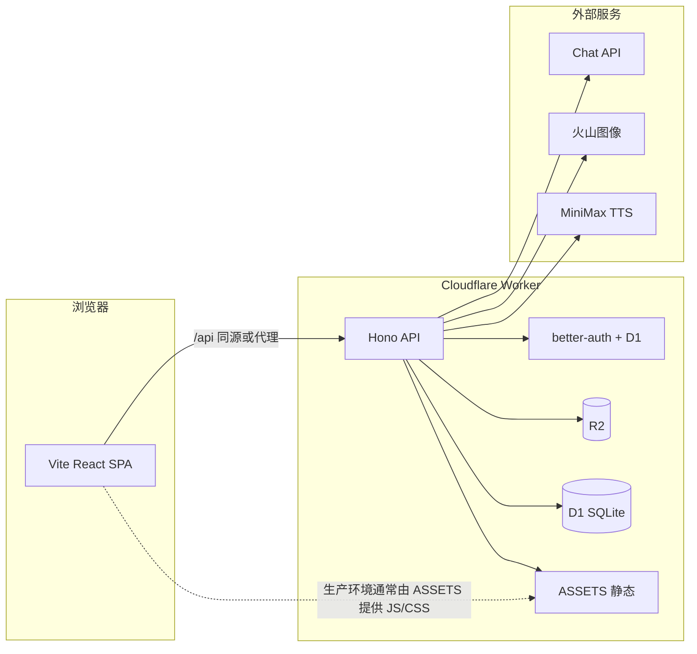

# japanese-cards

日语学习卡片相关应用。仓库为 pnpm workspace，包含前端（Vite + React）、后端（Hono，面向 Cloudflare Workers）与共享类型包。

## 架构概览

下图描述浏览器、Worker 内的 API/认证/存储与外部服务之间的关系。

```mermaid
flowchart LR
    subgraph browser [浏览器]
        FE[Vite React SPA]
    end
    subgraph worker [Cloudflare Worker]
        Hono[Hono API]
        BA[better-auth + D1]
        Hono --> BA
        Hono --> R2[(R2)]
        Hono --> D1[(D1 SQLite)]
        Hono --> ASSETS[ASSETS 静态]
    end
    subgraph external [外部服务]
        LLM[Chat API]
        VOLC[火山图像]
        TTS[MiniMax TTS]
    end
    FE -->|"/api 同源或代理"| Hono
    Hono --> LLM
    Hono --> VOLC
    Hono --> TTS
    FE -.->|生产环境通常由 ASSETS 提供 JS/CSS| ASSETS
```
